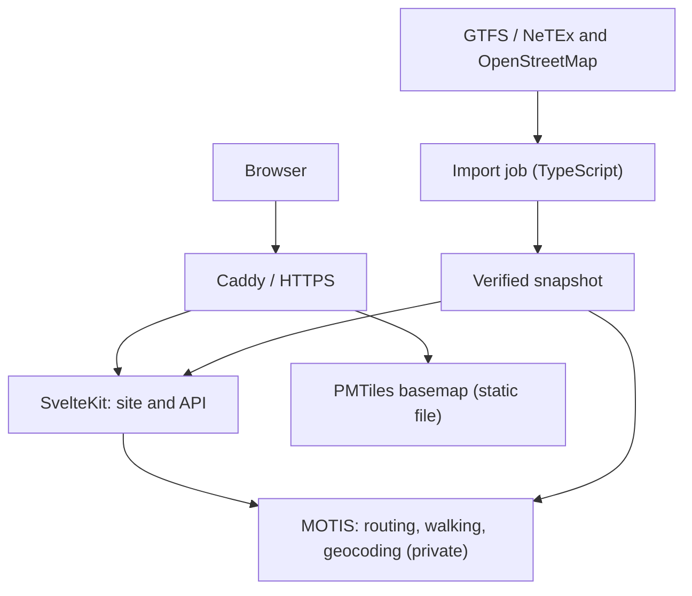

# Architecture

## Chosen components

| Area | Choice | Reason |
| --- | --- | --- |
| Application | SvelteKit 2, Svelte 5, TypeScript, adapter-node | One project for UI, pages and API |
| Runtime | Node.js 24 LTS; npm with lockfile | Supported base and reproducible build; move to Node 26 LTS after launch |
| Routing | MOTIS v2.11.3, private service | Timetables, walking network and geocoding in one engine; already tested on timetables |
| Geocoding | MOTIS built-in geocoding on the regional OSM extract | Search by place without public Nominatim or commercial APIs |
| Maps | MapLibre GL JS, Protomaps basemap as a regional PMTiles file served by Caddy | One static file, no tile server, no external requests |
| Pipeline | TypeScript on Node; GTFS validator and osmium-tool as pinned containers or packages | Same language as the app; external tools stay isolated |
| Persistence | Immutable snapshots, JSON/YAML and files on disk | No user data to manage; small catalogue |
| Cache | In-memory LRU, max 64 MiB, TTL 15 min | Avoids repeated searches without an extra service |
| Operations | Docker Compose and Caddy | One server, HTTPS and understandable updates |
| Verification | Vitest, Playwright, accessibility checks | Logic, integration and desktop/mobile flows |

Pinned versions at the time of writing: SvelteKit 2.70.3, Svelte 5.57.1, Vite 8.3.1, TypeScript 5.9.3 (openapi-typescript 7.13 does not support TypeScript 6 yet), Ajv 8.20 for runtime validation, MapLibre GL JS 6.11.2, MOTIS 2.11.3. `npm audit` reports a low-severity advisory in `cookie` < 0.7 pulled by SvelteKit; the suggested fix downgrades SvelteKit, so it is accepted until SvelteKit updates it. Record exact versions in the first commit; no automatic engine updates in production.

MOTIS publishes `linux-amd64` and `linux-arm64` builds, so both x86 and ARM servers are viable.

The proxy exposes only the application and static assets. MOTIS stays on the private network: raw routing, geocoding, metrics and internal ports are never public; the app calls them through the adapter.

## Code boundaries

- `src/lib/server/motis`: requests, timeouts and response normalisation.
- `src/lib/domain`: constraints, outbound/return pairing, classification and ranking (pure functions).
- `src/lib/server/catalogue`: stops, destinations and manifest of the active snapshot.
- `src/lib/i18n`: Italian and English message catalogues.
- `src/routes/api/v1`: controlled public contract.
- `src/lib/components`: form, results, detail and lazily loaded map.
- `pipeline`: acquisition, validation and snapshot build (TypeScript).
- `catalogue`: destination YAML files and their schema.
- `config`: sources and reproducible settings.
- `tests`: synthetic fixtures, integration and user flows.

Runtime configuration (environment): `DOVEARRIVO_BACKEND` (`mock` or `motis`), `MOTIS_URL`, `DOVEARRIVO_CATALOGUE` (default `catalogue/destinations.yaml`), `DOVEARRIVO_MANIFEST` (snapshot manifest written by the pipeline) and `DOVEARRIVO_INCLUDE_DRAFTS` (local development only).

UI and API share types generated from the [OpenAPI](../spec/api.openapi.yaml) contract. The backend still validates input at runtime.

## Deliberate choices

**No application microservices, Postgres or Redis in v0.1.** Product data are small files read at startup. The engine keeps its own optimised format.

**Curated destinations and complete itineraries.** About 20 destinations mean about 40 initial MOTIS requests per search. Concurrency, cache and deadlines are bounded; optimisation with one-to-all or precomputation comes after a measurement, never before correctness.

**Start from a stop, then from a place.** Phase 2 uses stops only, which makes the start of the journey explicit. Phase 3 adds place and address search via MOTIS geocoding; the chosen place becomes a coordinate origin and walking to the first stop counts toward the walking limit. Nearby stops or stops with the same name are never merged arbitrarily.

**Self-hosted basemap.** A Protomaps PMTiles extract for the region, with a style, fonts and sprites whose licences are recorded. Fallback if self-hosting is blocked: [OpenFreeMap](https://openfreemap.org) (free, no key, production use allowed), behind a configurable style URL. Never depend on MapLibre demo tiles or on public Transitous APIs.

**Simple operations first.** One MOTIS instance, nightly rebuild with a short declared maintenance window and a last-known-good snapshot for rollback. Zero-downtime switching between two instances is a post-launch improvement, not a v0.1 requirement.

## Initial limits to measure

At most 24 destinations in the active catalogue, 4 simultaneous MOTIS calls globally, 2 s timeout per call, 12 s budget per search, at most 96 calls including extra pages. Cache key: exact input, catalogue version, engine version and data snapshot.

These are proposed starting values. Target: p95 under 5 s with warm cache and under 12 s with cold cache, with 5 simultaneous searches. If the test fails, shrink the beta catalogue or add precomputation; never weaken the return check.

MOTIS remains replaceable through the adapter. OpenTripPlanner is a possible alternative, to consider only after a demonstrated limit.
